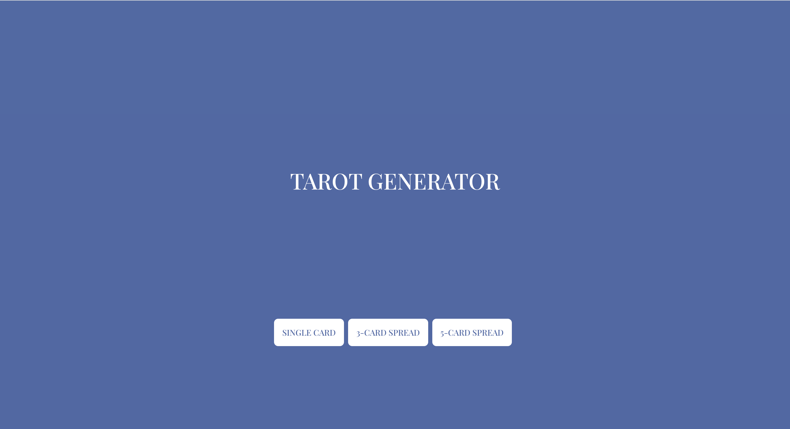
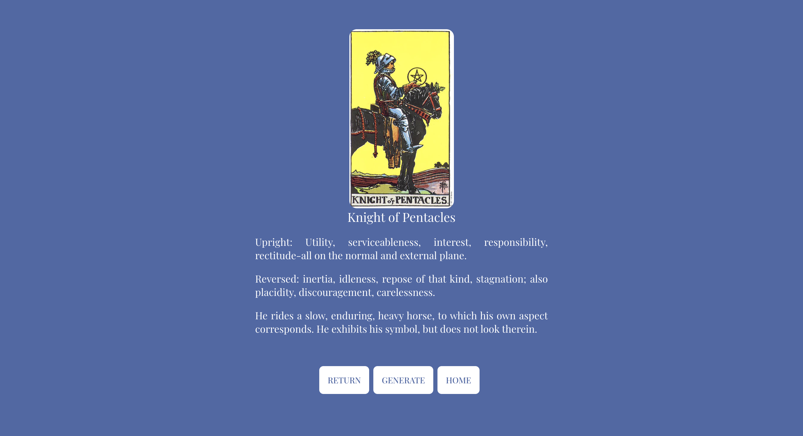
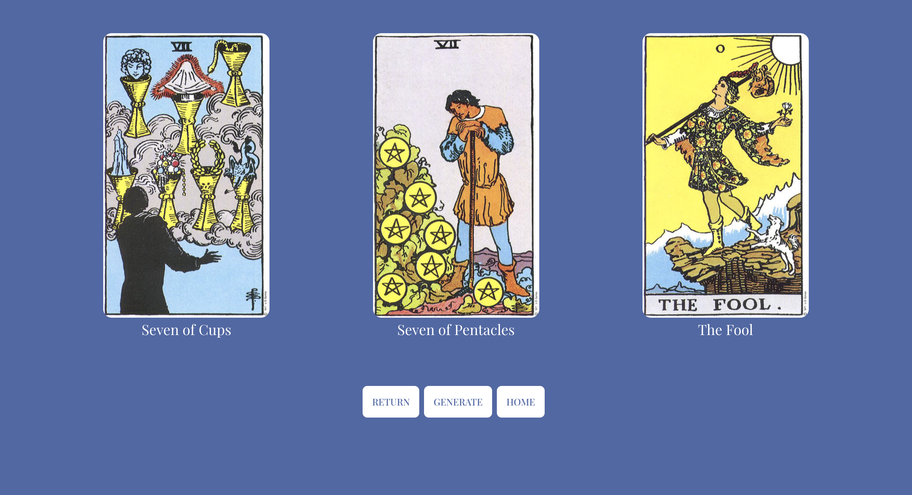

# Day 1 - Tarot Generator 🔮

The Tarot Generator App provides users with random tarot card readings. Users can choose between single card draws or more complex spreads. It also provides detailed interpretations for each card.

## Screenshots

## Features

- **Single Card Reading:** Generate a random tarot card along with its meaning.
- **3-Card Spread:** 
- **5-Card Spread:** 
- **Detailed Interpretations:** View upright and reversed meanings for each card.
- **Return Functionality:** Easily return to previous states and card readings.

## Technologies Used
- HTML, CSS, JavaScript, React.js

## JSON Data
- from @ekelen's tarot-api repo