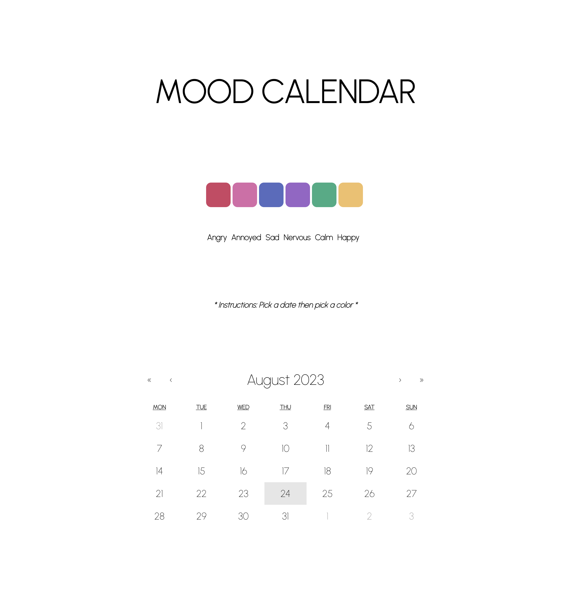

# Day 2 - Mood Calendar 🗓

Welcome to the Mood Calendar! This app allows you to track your mood by selecting different colors for each day on a calendar. It's a visual way to see how your mood changes over time.

## Features

- Select a mood color for each day on the calendar.
- Visualize mood changes over different days.
- Differentiate between the current month and previous months' entries.

## Technologies Used
- HTML, CSS, JavaScript, React.js, react-calendar
- Learn more about [react-calendar](https://www.npmjs.com/package/react-calendar).

