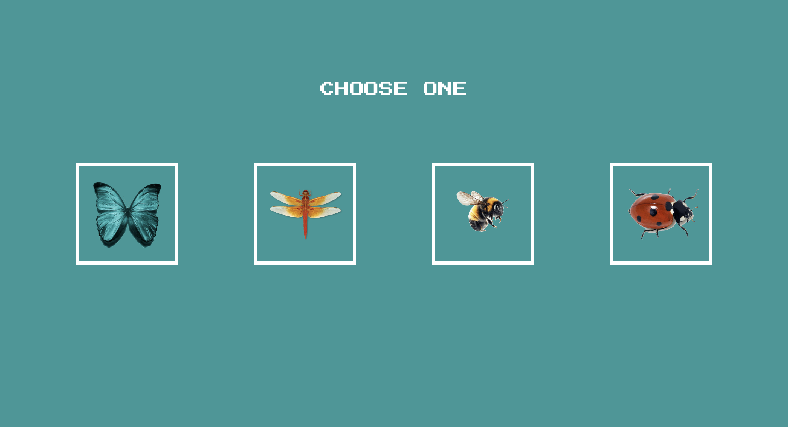
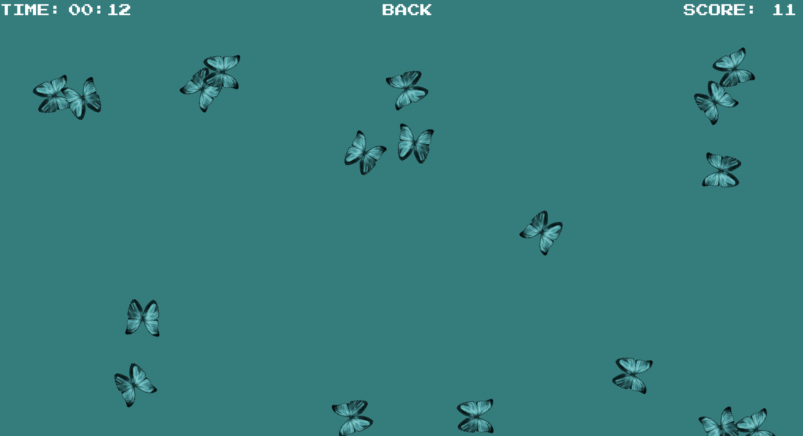
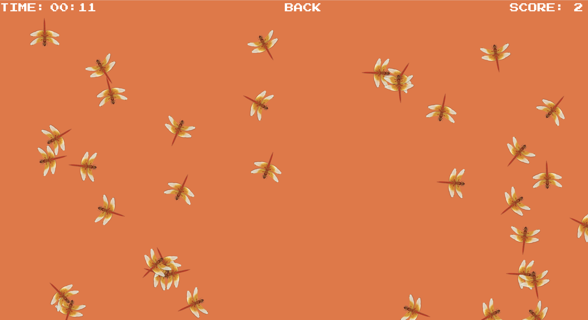
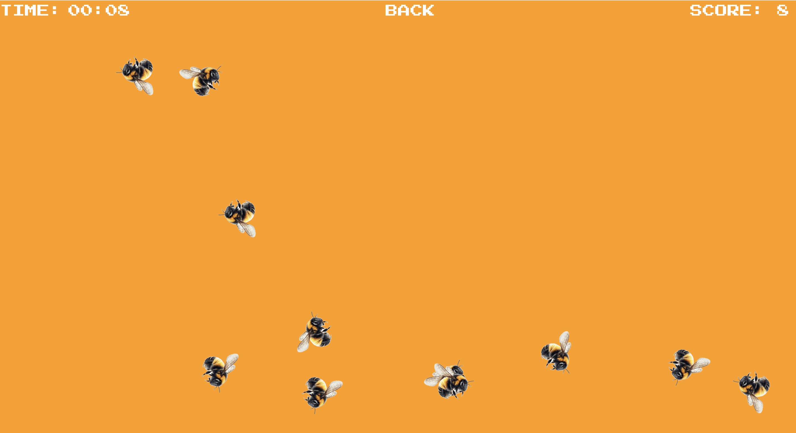
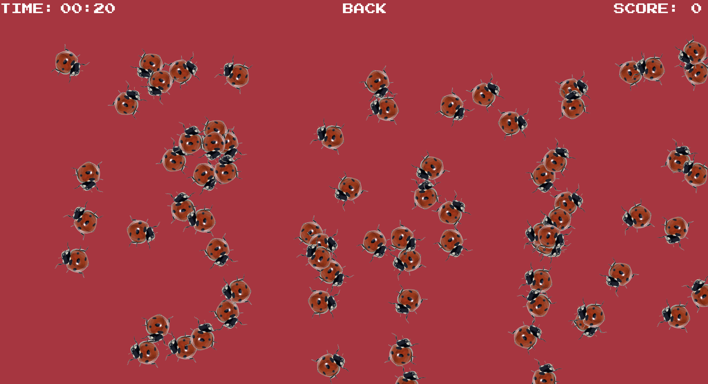

# Insect Catcher Game 🦋🐝🐞

Insect Catcher is a simple game where you catch randomly generated insects by clicking on them. The goal is to catch as many insects as you can within a set time frame and earn a high score.

# How to Play
- Click on "START" to begin the game.
- Choose an insect to catch from the options provided.
- Click on the insects that appear on the game board to catch them.
- Your score will increase with each insect caught.
- Click "BACK" to return to the insect selection screen or end the game.

# Features
- Randomly generated insects for a dynamic gameplay experience.
- Timer to track the game duration.
- Scoreboard to display your current score.
- Option to choose different insects to catch.
- "BACK" button to return to the insect selection screen or end the game.

## Technologies Used
- HTML, CSS, JavaScript, React.js